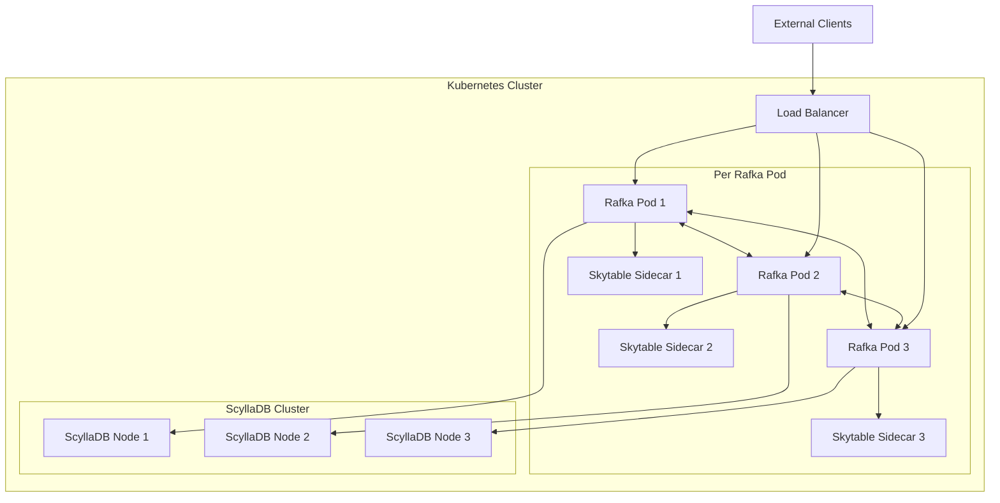

# Rafka Infrastructure

A distributed message broker system using Rafka, ScyllaDB, and Skytable.

## Architecture Overview



## Components

### Rafka
- Distributed message broker
- Horizontal scaling with pod anti-affinity
- Direct pod-to-pod communication via headless service
- Connection pooling for ScyllaDB access

### Skytable
- In-memory data store
- Runs as sidecar in each Rafka pod
- Optimized for fast local access
- No persistence (memory-only)

### ScyllaDB
- Persistent storage layer
- Distributed database cluster
- High throughput write operations
- Data durability guarantee

## Directory Structure
```
infra/
├── k8s/
│   ├── base/               # Base configurations
│   │   ├── rafka/          # Rafka and Skytable configs
│   │   ├── scylla/         # ScyllaDB configurations
│   │   ├── monitoring/     # Prometheus & Grafana
│   │   └── skytable/       # Skytable configurations
│   └── overlays/           # Environment-specific configs (TBD)
│       ├── dev/
│       └── prod/
└── scripts/                # Deployment scripts
```

## Quick Start

Deploy everything using the deployment script:
```bash
./scripts/deploy.sh
```

This script will:
1. Set up ScyllaDB cluster
2. Deploy Rafka with Skytable sidecars
3. Configure monitoring (Prometheus + Grafana)
4. Wait for all pods to be ready

Monitor deployment:
```bash
kubectl get pods    # Check pod status
kubectl logs -f <pod-name>    # Stream logs
```

## Monitoring

- Prometheus for metrics collection
- Grafana for visualization
- Custom dashboards for:
  * Message throughput
  * System resources
  * Latency metrics
  * Error rates

## Network Architecture

1. Internal Communication:
   - Headless service for pod discovery
   - Direct pod-to-pod communication
   - Optimized connection pooling

2. External Access:
   - Direct pod access via headless service
   - Client-side load balancing for optimal performance
   - Network policies for security

## Performance Optimization

See [Performance Tuning Guide](docs/performance-tuning.md) for detailed information about:
- Resource allocation
- Connection pooling
- Network optimization
- Scaling guidelines

## Operations

See [Operations Guide](docs/operations.md) for:
- Deployment procedures
- Scaling operations
- Backup and recovery
- Troubleshooting 